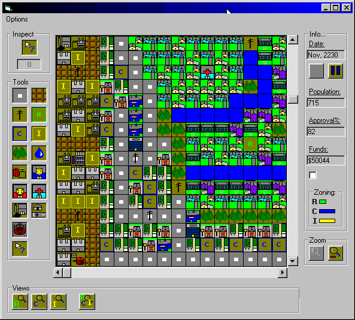



## orig sim city clone\!

### Description

still working on it... it's pure vb code, so it's kind of hard to follow. but play around with it, a lot of works. towns and approval ratings are very reactive. (it's kind of easy to make money, yet though). enjoy
 
### More Info
 

             |
---                |---
**Submitted On**   |2003-12-14 01:51:18
**By**             |[john hollister](https://github.com/Planet-Source-Code/PSCIndex/blob/master/ByAuthor/john-hollister.md)
**Level**          |Advanced
**User Rating**    |4.0 (16 globes from 4 users)
**Compatibility**  |VB 6\.0
**Category**       |[Games](https://github.com/Planet-Source-Code/PSCIndex/blob/master/ByCategory/games__1-38.md)
**World**          |[Visual Basic](https://github.com/Planet-Source-Code/PSCIndex/blob/master/ByWorld/visual-basic.md)
**Archive File**   |[orig\_sim\_c16835912142003\.zip](https://github.com/Planet-Source-Code/john-hollister-orig-sim-city-clone__1-50406/archive/master.zip)

